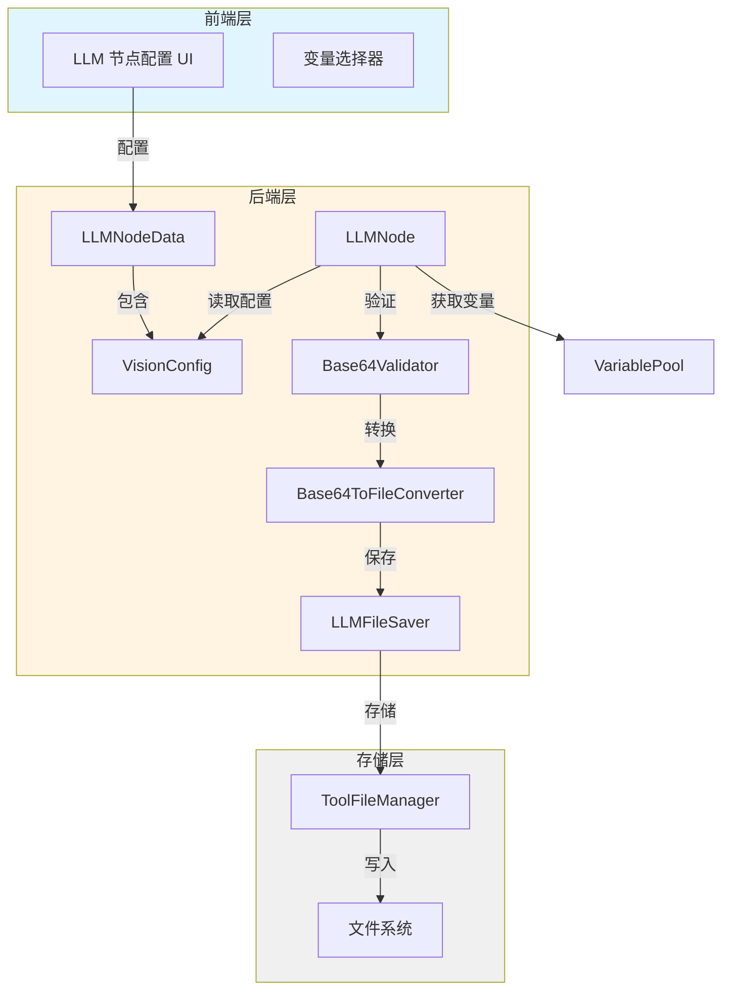
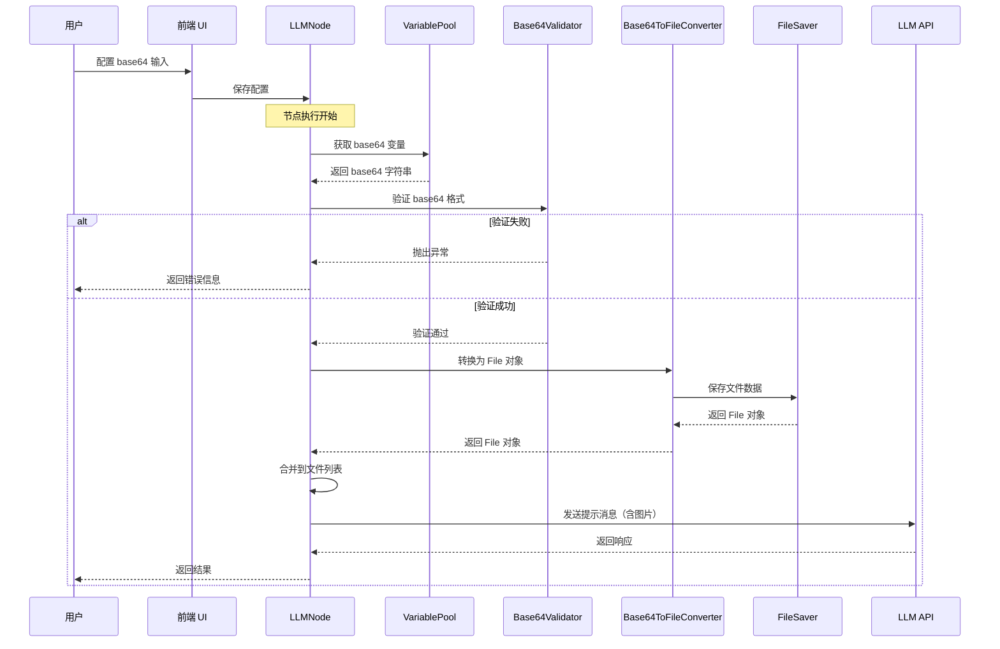

# Design Document

## Overview

本设计为 Dify 工作流编排的 LLM 节点视觉输入功能增加 base64 图片字符串输入支持。设计遵循现有的文件处理架构，通过扩展 `VisionConfig` 实体和增加 base64 验证转换逻辑，实现与现有文件变量输入的无缝集成。

核心设计思路：
1. 扩展视觉配置实体，支持两种输入模式（文件变量 / Base64 字符串）
2. 在节点执行时验证并转换 base64 字符串为 File 对象
3. 复用现有的文件处理流程，保持向后兼容

## Architecture

### 系统架构图



### 数据流图



## Components and Interfaces

### 1. VisionConfig 扩展

**位置**: `api/core/workflow/nodes/llm/entities.py`

```python
from enum import Enum
from typing import Literal

class VisionInputMode(str, Enum):
    """视觉输入模式枚举"""
    FILE_VARIABLE = "file_variable"  # 文件变量模式（默认）
    BASE64_STRING = "base64_string"  # Base64 字符串模式

class VisionConfigOptions(BaseModel):
    # 现有字段
    variable_selector: Sequence[str] = Field(default_factory=lambda: ["sys", "files"])
    detail: ImagePromptMessageContent.DETAIL = ImagePromptMessageContent.DETAIL.HIGH
    
    # 新增字段
    input_mode: VisionInputMode = Field(
        default=VisionInputMode.FILE_VARIABLE,
        description="视觉输入模式：file_variable 或 base64_string"
    )
    base64_variable_selector: Sequence[str] | None = Field(
        default=None,
        description="Base64 字符串变量选择器，仅在 input_mode 为 base64_string 时使用"
    )

class VisionConfig(BaseModel):
    enabled: bool = False
    configs: VisionConfigOptions = Field(default_factory=VisionConfigOptions)
    
    @field_validator("configs", mode="before")
    @classmethod
    def convert_none_configs(cls, v: Any):
        if v is None:
            return VisionConfigOptions()
        return v
```

**设计说明**:
- `input_mode`: 控制输入模式，默认为文件变量模式保持向后兼容
- `base64_variable_selector`: 当模式为 base64_string 时，指定包含 base64 字符串的变量路径
- 保持 `variable_selector` 用于文件变量模式

### 2. Base64 验证器

**位置**: `api/core/workflow/nodes/llm/base64_validator.py` (新文件)

```python
import base64
import imghdr
import re
from typing import Literal

from .exc import Base64ValidationError

class Base64Validator:
    """Base64 图片字符串验证器"""
    
    # 支持的图片格式
    SUPPORTED_IMAGE_FORMATS = {"jpeg", "png", "gif", "webp", "bmp"}
    
    # Data URI scheme 正则表达式
    DATA_URI_PATTERN = re.compile(
        r'^data:image/(jpeg|png|gif|webp|bmp);base64,(.+)$',
        re.IGNORECASE
    )
    
    @classmethod
    def validate_and_extract(
        cls, 
        base64_string: str
    ) -> tuple[bytes, str]:
        """
        验证 base64 字符串并提取图片数据
        
        Args:
            base64_string: Base64 编码的图片字符串（可能包含 data URI scheme）
            
        Returns:
            tuple[bytes, str]: (图片二进制数据, MIME 类型)
            
        Raises:
            Base64ValidationError: 验证失败时抛出
        """
        if not base64_string or not isinstance(base64_string, str):
            raise Base64ValidationError("Base64 string cannot be empty")
        
        # 去除首尾空白字符
        base64_string = base64_string.strip()
        
        # 检查是否包含 data URI scheme
        mime_type = None
        match = cls.DATA_URI_PATTERN.match(base64_string)
        if match:
            image_format = match.group(1).lower()
            base64_data = match.group(2)
            mime_type = f"image/{image_format}"
        else:
            base64_data = base64_string
        
        # 验证 base64 格式
        try:
            image_data = base64.b64decode(base64_data, validate=True)
        except Exception as e:
            raise Base64ValidationError(f"Invalid base64 encoding: {str(e)}")
        
        # 验证是否为有效图片
        detected_format = imghdr.what(None, h=image_data)
        if detected_format not in cls.SUPPORTED_IMAGE_FORMATS:
            raise Base64ValidationError(
                f"Unsupported image format. Detected: {detected_format}, "
                f"Supported: {', '.join(cls.SUPPORTED_IMAGE_FORMATS)}"
            )
        
        # 如果没有从 data URI 中提取 MIME 类型，则使用检测到的格式
        if mime_type is None:
            mime_type = f"image/{detected_format}"
        
        return image_data, mime_type
```

**设计说明**:
- 支持带 data URI scheme 前缀的 base64 字符串（如 `data:image/png;base64,...`）
- 支持纯 base64 字符串
- 使用 `imghdr` 模块验证图片格式
- 返回二进制数据和 MIME 类型供后续处理

### 3. Base64 到 File 转换器

**位置**: `api/core/workflow/nodes/llm/base64_converter.py` (新文件)

```python
import logging
from typing import TYPE_CHECKING

from core.file import File, FileType
from .base64_validator import Base64Validator
from .exc import Base64ConversionError

if TYPE_CHECKING:
    from .file_saver import LLMFileSaver

logger = logging.getLogger(__name__)

class Base64ToFileConverter:
    """Base64 字符串到 File 对象转换器"""
    
    def __init__(self, file_saver: "LLMFileSaver"):
        self.file_saver = file_saver
        self.validator = Base64Validator()
    
    def convert(self, base64_string: str) -> File:
        """
        将 base64 字符串转换为 File 对象
        
        Args:
            base64_string: Base64 编码的图片字符串
            
        Returns:
            File: 转换后的 File 对象
            
        Raises:
            Base64ConversionError: 转换失败时抛出
        """
        try:
            # 验证并提取图片数据
            image_data, mime_type = self.validator.validate_and_extract(base64_string)
            
            # 记录日志
            logger.info(
                f"Converting base64 string to file: "
                f"mime_type={mime_type}, size={len(image_data)} bytes"
            )
            
            # 使用文件保存器保存图片
            file = self.file_saver.save_binary_string(
                data=image_data,
                mime_type=mime_type,
                file_type=FileType.IMAGE,
            )
            
            logger.info(f"Successfully converted base64 to file: file_id={file.related_id}")
            
            return file
            
        except Exception as e:
            logger.error(f"Failed to convert base64 string to file: {str(e)}")
            raise Base64ConversionError(f"Failed to convert base64 string: {str(e)}")
```

**设计说明**:
- 依赖注入 `LLMFileSaver` 实现文件保存
- 复用现有的 `save_binary_string` 方法
- 完善的日志记录便于问题排查

### 4. 异常类定义

**位置**: `api/core/workflow/nodes/llm/exc.py` (扩展现有文件)

```python
class Base64ValidationError(LLMNodeError):
    """Base64 验证错误"""
    pass

class Base64ConversionError(LLMNodeError):
    """Base64 转换错误"""
    pass
```

### 5. LLMNode 集成

**位置**: `api/core/workflow/nodes/llm/node.py` (修改现有文件)

在 `_run` 方法中修改文件获取逻辑：

```python
def _run(self) -> Generator:
    # ... 现有代码 ...
    
    # fetch files - 修改此部分
    files = []
    if self.node_data.vision.enabled:
        vision_config = self.node_data.vision.configs
        
        if vision_config.input_mode == VisionInputMode.FILE_VARIABLE:
            # 文件变量模式（原有逻辑）
            files = llm_utils.fetch_files(
                variable_pool=variable_pool,
                selector=vision_config.variable_selector,
            )
        elif vision_config.input_mode == VisionInputMode.BASE64_STRING:
            # Base64 字符串模式（新增逻辑）
            if vision_config.base64_variable_selector:
                files = self._fetch_base64_files(
                    variable_pool=variable_pool,
                    selector=vision_config.base64_variable_selector,
                )
    
    # ... 现有代码继续 ...

def _fetch_base64_files(
    self, 
    variable_pool: VariablePool, 
    selector: Sequence[str]
) -> list[File]:
    """
    从变量池获取 base64 字符串并转换为 File 对象
    
    Args:
        variable_pool: 变量池
        selector: 变量选择器
        
    Returns:
        list[File]: 转换后的 File 对象列表
    """
    from .base64_converter import Base64ToFileConverter
    
    variable = variable_pool.get(selector)
    if variable is None:
        return []
    
    converter = Base64ToFileConverter(file_saver=self._llm_file_saver)
    files = []
    
    # 处理单个字符串
    if isinstance(variable, StringSegment):
        try:
            file = converter.convert(variable.value)
            files.append(file)
        except Exception as e:
            logger.error(f"Failed to convert base64 string: {str(e)}")
            raise
    
    # 处理字符串数组
    elif isinstance(variable, ArraySegment):
        for item in variable.value:
            if isinstance(item, str):
                try:
                    file = converter.convert(item)
                    files.append(file)
                except Exception as e:
                    logger.error(f"Failed to convert base64 string in array: {str(e)}")
                    raise
    
    return files
```

**设计说明**:
- 根据 `input_mode` 选择不同的文件获取逻辑
- 支持单个 base64 字符串和字符串数组
- 错误处理和日志记录
- 保持与现有文件处理流程的一致性

### 6. 变量映射扩展

在 `_extract_variable_selector_to_variable_mapping` 方法中添加 base64 变量映射：

```python
@classmethod
def _extract_variable_selector_to_variable_mapping(
    cls,
    *,
    graph_config: Mapping[str, Any],
    node_id: str,
    node_data: Mapping[str, Any],
) -> Mapping[str, Sequence[str]]:
    # ... 现有代码 ...
    
    if typed_node_data.vision.enabled:
        vision_config = typed_node_data.vision.configs
        if vision_config.input_mode == VisionInputMode.FILE_VARIABLE:
            variable_mapping["#files#"] = vision_config.variable_selector
        elif vision_config.input_mode == VisionInputMode.BASE64_STRING:
            if vision_config.base64_variable_selector:
                variable_mapping["#base64_images#"] = vision_config.base64_variable_selector
    
    # ... 现有代码继续 ...
```

## Data Models

### VisionInputMode 枚举

```python
class VisionInputMode(str, Enum):
    FILE_VARIABLE = "file_variable"
    BASE64_STRING = "base64_string"
```

### VisionConfigOptions 数据模型

```python
class VisionConfigOptions(BaseModel):
    variable_selector: Sequence[str] = Field(default_factory=lambda: ["sys", "files"])
    detail: ImagePromptMessageContent.DETAIL = ImagePromptMessageContent.DETAIL.HIGH
    input_mode: VisionInputMode = Field(default=VisionInputMode.FILE_VARIABLE)
    base64_variable_selector: Sequence[str] | None = Field(default=None)
```

### 前端配置数据结构

```typescript
interface VisionConfig {
  enabled: boolean;
  configs: {
    variable_selector: string[];
    detail: 'high' | 'low';
    input_mode: 'file_variable' | 'base64_string';
    base64_variable_selector?: string[];
  };
}
```

## Correctness Properties

*A property is a characteristic or behavior that should hold true across all valid executions of a system-essentially, a formal statement about what the system should do. Properties serve as the bridge between human-readable specifications and machine-verifiable correctness guarantees.*

### Property 1: Base64 格式验证正确性

*For any* base64 字符串输入，如果字符串是有效的 base64 编码且解码后是支持的图片格式，则验证应该通过并返回正确的图片数据和 MIME 类型

**Validates: Requirements 2.1, 2.2**

### Property 2: Base64 验证拒绝无效输入

*For any* 无效的 base64 字符串（格式错误或非图片数据），验证器应该抛出 `Base64ValidationError` 异常并包含描述性错误信息

**Validates: Requirements 2.3**

### Property 3: Data URI Scheme 解析正确性

*For any* 包含 data URI scheme 前缀的 base64 字符串（如 `data:image/png;base64,...`），验证器应该正确提取 MIME 类型和 base64 数据

**Validates: Requirements 2.4**

### Property 4: Base64 到 File 转换幂等性

*For any* 有效的 base64 字符串，多次转换应该产生内容相同的 File 对象（文件 ID 可能不同，但内容、大小、MIME 类型应该相同）

**Validates: Requirements 3.1, 3.2, 3.3**

### Property 5: 文件存储一致性

*For any* 成功转换的 File 对象，其存储的二进制数据应该与原始 base64 解码后的数据完全一致

**Validates: Requirements 3.4**

### Property 6: 输入模式隔离性

*For any* LLM 节点配置，当 `input_mode` 为 `file_variable` 时，系统应该只使用 `variable_selector`；当为 `base64_string` 时，应该只使用 `base64_variable_selector`

**Validates: Requirements 4.1, 4.2, 4.3**

### Property 7: 文件列表合并正确性

*For any* base64 转换的文件列表，合并到最终文件列表后，所有文件应该能够被 LLM 正确处理，且顺序保持一致

**Validates: Requirements 4.4**

### Property 8: 错误日志完整性

*For any* base64 处理失败的情况，系统应该记录包含错误类型、错误原因和输入数据摘要（不包含完整 base64 数据）的日志

**Validates: Requirements 5.1, 5.2**

### Property 9: 向后兼容性保持

*For any* 未配置 base64 输入的旧版本工作流，系统应该使用默认的 `file_variable` 模式，且行为与升级前完全一致

**Validates: Requirements 7.1, 7.2, 7.3**

## Error Handling

### 错误类型和处理策略

| 错误类型 | 异常类 | 处理策略 | 用户提示 |
|---------|--------|---------|---------|
| Base64 格式错误 | `Base64ValidationError` | 记录日志，中断节点执行 | "Base64 字符串格式无效，请检查输入" |
| 非图片数据 | `Base64ValidationError` | 记录日志，中断节点执行 | "Base64 数据不是有效的图片格式" |
| 不支持的图片格式 | `Base64ValidationError` | 记录日志，中断节点执行 | "不支持的图片格式，仅支持 JPEG, PNG, GIF, WEBP, BMP" |
| 文件保存失败 | `Base64ConversionError` | 记录详细日志，中断节点执行 | "图片保存失败，请稍后重试" |
| 变量不存在 | `VariableNotFoundError` | 记录日志，中断节点执行 | "未找到指定的 base64 变量" |
| 变量类型错误 | `InvalidVariableTypeError` | 记录日志，中断节点执行 | "变量类型错误，期望字符串或字符串数组" |

### 错误日志格式

```python
# 验证失败日志
logger.error(
    f"Base64 validation failed: {error_message}, "
    f"input_length={len(base64_string)}, "
    f"input_preview={base64_string[:50]}..."
)

# 转换失败日志
logger.error(
    f"Base64 conversion failed: {error_message}, "
    f"mime_type={mime_type}, "
    f"data_size={len(image_data)}"
)

# 成功日志
logger.info(
    f"Base64 file converted successfully: "
    f"file_id={file.related_id}, "
    f"mime_type={file.mime_type}, "
    f"size={file.size}"
)
```

## Testing Strategy

### 单元测试

**测试文件**: `api/tests/unit_tests/core/workflow/nodes/llm/test_base64_validator.py`

测试用例：
1. 测试有效的纯 base64 字符串
2. 测试带 data URI scheme 的 base64 字符串
3. 测试各种图片格式（JPEG, PNG, GIF, WEBP, BMP）
4. 测试无效的 base64 格式
5. 测试非图片数据
6. 测试空字符串和 None 值
7. 测试超大图片数据

**测试文件**: `api/tests/unit_tests/core/workflow/nodes/llm/test_base64_converter.py`

测试用例：
1. 测试成功转换单个 base64 字符串
2. 测试转换后的 File 对象属性
3. 测试文件保存器集成
4. 测试转换失败场景
5. 测试日志记录

**测试文件**: `api/tests/unit_tests/core/workflow/nodes/llm/test_llm_node_base64.py`

测试用例：
1. 测试 base64 模式的文件获取
2. 测试文件变量模式的向后兼容
3. 测试两种模式的隔离性
4. 测试字符串数组处理
5. 测试错误处理流程

### 属性测试

**测试文件**: `api/tests/unit_tests/core/workflow/nodes/llm/test_base64_properties.py`

使用 `hypothesis` 库进行属性测试，每个测试至少运行 100 次：

```python
from hypothesis import given, strategies as st
import base64

@given(st.binary(min_size=100, max_size=10000))
def test_base64_round_trip_property(image_data):
    """
    Feature: llm-node-base64-vision-input, Property 5: 文件存储一致性
    
    For any valid image data, encoding to base64 and then converting back
    should produce identical binary data.
    """
    # 编码为 base64
    base64_string = base64.b64encode(image_data).decode('utf-8')
    
    # 验证并提取
    validator = Base64Validator()
    extracted_data, _ = validator.validate_and_extract(base64_string)
    
    # 验证数据一致性
    assert extracted_data == image_data
```

### 集成测试

**测试文件**: `api/tests/integration_tests/workflow/nodes/test_llm_base64_integration.py`

测试场景：
1. 完整的工作流执行（包含 base64 输入的 LLM 节点）
2. 多个 base64 图片的处理
3. base64 和文件变量混合使用
4. 错误场景的端到端测试

### 前端测试

**测试文件**: `web/app/components/workflow/nodes/llm/vision-config.test.tsx`

测试用例：
1. 输入模式切换
2. 变量选择器显示和隐藏
3. 配置数据序列化和反序列化
4. UI 提示文案显示

## Implementation Notes

### 实现顺序

1. **后端实体和验证器** (优先级：高)
   - 扩展 `VisionConfig` 实体
   - 实现 `Base64Validator`
   - 实现 `Base64ToFileConverter`
   - 添加异常类

2. **LLMNode 集成** (优先级：高)
   - 修改 `_run` 方法的文件获取逻辑
   - 实现 `_fetch_base64_files` 方法
   - 更新变量映射逻辑

3. **单元测试** (优先级：高)
   - 验证器测试
   - 转换器测试
   - LLMNode 集成测试

4. **前端实现** (优先级：中)
   - 修改视觉配置 UI 组件
   - 添加输入模式选择
   - 添加 base64 变量选择器
   - 更新配置序列化逻辑

5. **属性测试和集成测试** (优先级：中)
   - 实现属性测试
   - 实现集成测试

6. **文档和示例** (优先级：低)
   - 更新 API 文档
   - 添加使用示例
   - 更新用户手册

### 性能考虑

1. **Base64 解码性能**: 对于大图片（>10MB），base64 解码可能耗时较长，建议在文档中提示用户
2. **内存使用**: Base64 字符串和解码后的二进制数据会同时存在于内存中，需要注意内存峰值
3. **文件存储**: 转换后的文件会永久存储，需要考虑存储空间管理

### 安全考虑

1. **输入大小限制**: 建议限制 base64 字符串的最大长度（如 20MB）
2. **格式验证**: 严格验证图片格式，防止恶意文件上传
3. **错误信息**: 错误日志不应包含完整的 base64 数据，只记录摘要信息

### 向后兼容性

1. **默认值**: `input_mode` 默认为 `file_variable`，确保旧配置正常工作
2. **配置迁移**: 旧配置加载时自动设置为 `file_variable` 模式
3. **API 兼容**: 不修改现有 API 接口，只扩展配置选项
