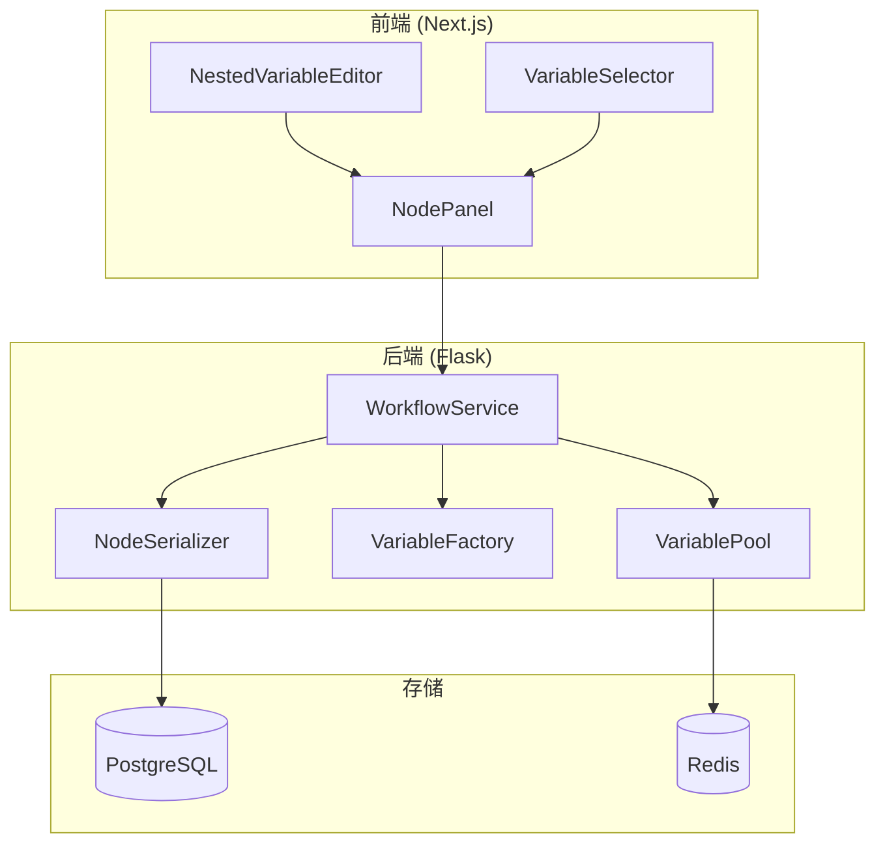
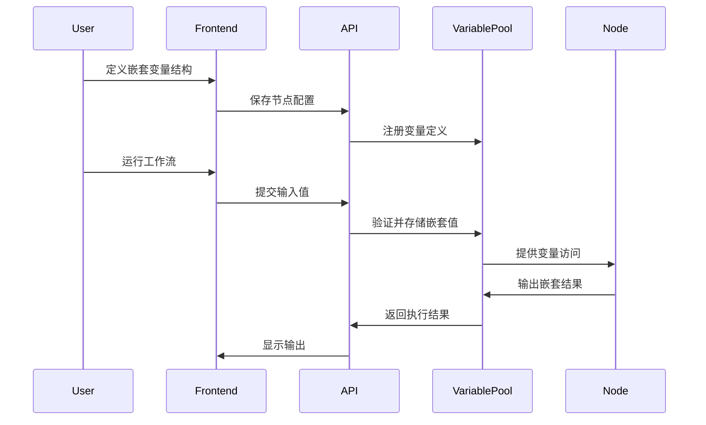

# Design Document: Nested Variable Support

## Overview

本设计文档描述了 Dify 工作流节点中支持复杂对象与数组嵌套变量传递的技术实现方案。该功能涉及前端 UI 组件、后端数据结构、变量池管理和 API 接口的全面改造。

## Architecture

### 系统架构图



### 数据流图



## Components and Interfaces

### 1. 嵌套变量定义数据结构

#### NestedVariableDefinition (后端)

```python
# api/core/workflow/entities/nested_variable.py

from typing import Any, Optional, Sequence
from enum import StrEnum
from pydantic import BaseModel, Field, field_validator
import re

class NestedVariableType(StrEnum):
    """嵌套变量支持的类型"""
    STRING = "string"
    INTEGER = "integer"
    NUMBER = "number"
    BOOLEAN = "boolean"
    OBJECT = "object"
    FILE = "file"
    ARRAY_STRING = "array[string]"
    ARRAY_INTEGER = "array[integer]"
    ARRAY_NUMBER = "array[number]"
    ARRAY_OBJECT = "array[object]"
    ARRAY_BOOLEAN = "array[boolean]"
    ARRAY_FILE = "array[file]"
    
    def is_nestable(self) -> bool:
        """判断类型是否支持嵌套子变量"""
        return self in (NestedVariableType.OBJECT, NestedVariableType.ARRAY_OBJECT)
    
    def is_array(self) -> bool:
        """判断是否为数组类型"""
        return self.value.startswith("array[")

class NestedVariableDefinition(BaseModel):
    """嵌套变量定义"""
    name: str = Field(description="变量名称")
    type: NestedVariableType = Field(description="变量类型")
    required: bool = Field(default=False, description="是否必填")
    description: str = Field(default="", description="变量描述")
    default_value: Any = Field(default=None, description="默认值")
    children: Optional[Sequence["NestedVariableDefinition"]] = Field(
        default=None,
        description="子变量定义，仅用于 object 和 array[object] 类型"
    )
    
    @field_validator("name")
    @classmethod
    def validate_name(cls, v: str) -> str:
        """验证变量名称格式"""
        if not re.match(r"^[a-zA-Z][a-zA-Z0-9_]*$", v):
            raise ValueError(
                f"Variable name '{v}' must start with a letter and contain only "
                "alphanumeric characters and underscores"
            )
        return v
    
    @field_validator("children")
    @classmethod
    def validate_children(cls, v, info):
        """验证子变量只能用于可嵌套类型"""
        if v is not None:
            var_type = info.data.get("type")
            if var_type and not NestedVariableType(var_type).is_nestable():
                raise ValueError(
                    f"Children are only allowed for 'object' and 'array[object]' types, "
                    f"got '{var_type}'"
                )
            # 验证子变量名称唯一性
            names = [child.name for child in v]
            if len(names) != len(set(names)):
                raise ValueError("Child variable names must be unique within the same parent")
        return v
    
    def get_max_depth(self) -> int:
        """获取嵌套深度"""
        if not self.children:
            return 1
        return 1 + max(child.get_max_depth() for child in self.children)

# 允许递归引用
NestedVariableDefinition.model_rebuild()
```

#### NodeInputDefinition (后端)

```python
# api/core/workflow/entities/node_input.py

from typing import Any, Optional, Sequence
from pydantic import BaseModel, Field
from .nested_variable import NestedVariableDefinition, NestedVariableType

class EnhancedVariableSelector(BaseModel):
    """增强的变量选择器，支持嵌套路径"""
    variable: str = Field(description="变量引用字符串")
    value_selector: Sequence[str] = Field(description="变量选择器路径")
    
    def get_full_path(self) -> str:
        """获取完整路径字符串"""
        return ".".join(self.value_selector)

class NodeInputDefinition(BaseModel):
    """节点输入定义"""
    name: str = Field(description="输入名称")
    type: NestedVariableType = Field(description="输入类型")
    required: bool = Field(default=False, description="是否必填")
    description: str = Field(default="", description="输入描述")
    variable_selector: Optional[EnhancedVariableSelector] = Field(
        default=None,
        description="变量选择器"
    )
    children: Optional[Sequence[NestedVariableDefinition]] = Field(
        default=None,
        description="子变量定义"
    )
    default_value: Any = Field(default=None, description="默认值")

class NodeOutputDefinition(BaseModel):
    """节点输出定义"""
    name: str = Field(description="输出名称")
    type: NestedVariableType = Field(description="输出类型")
    description: str = Field(default="", description="输出描述")
    children: Optional[Sequence[NestedVariableDefinition]] = Field(
        default=None,
        description="子变量定义"
    )
```

### 2. 增强的变量池

```python
# api/core/workflow/runtime/enhanced_variable_pool.py

from typing import Any, Optional, Sequence
from copy import deepcopy
from core.workflow.runtime.variable_pool import VariablePool
from core.variables.segments import Segment, ObjectSegment
from core.workflow.entities.nested_variable import NestedVariableDefinition
from factories import variable_factory

class EnhancedVariablePool(VariablePool):
    """增强的变量池，支持嵌套变量操作"""
    
    def add_nested(
        self,
        selector: Sequence[str],
        value: Any,
        definition: Optional[NestedVariableDefinition] = None
    ) -> None:
        """
        添加嵌套变量
        
        Args:
            selector: 变量选择器 [node_id, variable_name]
            value: 变量值
            definition: 可选的变量定义，用于验证
        """
        if definition:
            self._validate_value_against_definition(value, definition)
        self.add(selector, value)
    
    def get_nested(
        self,
        selector: Sequence[str],
        nested_path: Optional[str] = None
    ) -> Optional[Segment]:
        """
        获取嵌套变量值
        
        Args:
            selector: 变量选择器 [node_id, variable_name]
            nested_path: 嵌套路径，如 'user.profile.name'
            
        Returns:
            对应的段对象，不存在时返回 None
        """
        if nested_path:
            path_parts = nested_path.split(".")
            extended_selector = list(selector) + path_parts
            return self.get(extended_selector)
        return self.get(selector)
    
    def set_nested(
        self,
        selector: Sequence[str],
        nested_path: str,
        value: Any
    ) -> bool:
        """
        设置嵌套变量值（创建新副本以保持不可变性）
        
        Args:
            selector: 变量选择器
            nested_path: 嵌套路径
            value: 要设置的值
            
        Returns:
            是否设置成功
        """
        root_segment = self.get(selector)
        if not isinstance(root_segment, ObjectSegment):
            return False
        
        # 深拷贝以保持不可变性
        new_obj = deepcopy(dict(root_segment.value))
        
        # 导航并设置值
        parts = nested_path.split(".")
        current = new_obj
        for part in parts[:-1]:
            if part not in current:
                current[part] = {}
            elif not isinstance(current[part], dict):
                return False
            current = current[part]
        
        current[parts[-1]] = value
        self.add(selector, new_obj)
        return True
    
    def _validate_value_against_definition(
        self,
        value: Any,
        definition: NestedVariableDefinition,
        path: str = ""
    ) -> None:
        """验证值是否符合定义"""
        from core.workflow.entities.nested_variable import NestedVariableType
        
        current_path = f"{path}.{definition.name}" if path else definition.name
        
        # 检查必填字段
        if value is None:
            if definition.required:
                raise ValueError(f"Required field '{current_path}' is missing")
            return
        
        # 类型验证
        type_validators = {
            NestedVariableType.STRING: lambda v: isinstance(v, str),
            NestedVariableType.INTEGER: lambda v: isinstance(v, int) and not isinstance(v, bool),
            NestedVariableType.NUMBER: lambda v: isinstance(v, (int, float)) and not isinstance(v, bool),
            NestedVariableType.BOOLEAN: lambda v: isinstance(v, bool),
            NestedVariableType.OBJECT: lambda v: isinstance(v, dict),
        }
        
        validator = type_validators.get(definition.type)
        if validator and not validator(value):
            raise ValueError(
                f"Type mismatch at '{current_path}': expected {definition.type}, "
                f"got {type(value).__name__}"
            )
        
        # 递归验证子字段
        if definition.children and isinstance(value, dict):
            for child_def in definition.children:
                child_value = value.get(child_def.name)
                self._validate_value_against_definition(child_value, child_def, current_path)
```

### 3. 嵌套变量验证器

```python
# api/core/workflow/validators/nested_variable_validator.py

from typing import Any, Dict, List, Optional
from core.workflow.entities.nested_variable import NestedVariableDefinition, NestedVariableType

MAX_NESTING_DEPTH = 5

class NestedVariableValidator:
    """嵌套变量验证器"""
    
    @classmethod
    def validate_definition(
        cls,
        definition: NestedVariableDefinition,
        current_depth: int = 1
    ) -> List[str]:
        """
        验证变量定义
        
        Returns:
            错误消息列表，空列表表示验证通过
        """
        errors = []
        
        # 检查嵌套深度
        if current_depth > MAX_NESTING_DEPTH:
            errors.append(
                f"Maximum nesting depth of {MAX_NESTING_DEPTH} exceeded at '{definition.name}'"
            )
            return errors
        
        # 验证子变量
        if definition.children:
            if not definition.type.is_nestable():
                errors.append(
                    f"Type '{definition.type}' does not support children at '{definition.name}'"
                )
            else:
                # 检查子变量名称唯一性
                names = [child.name for child in definition.children]
                duplicates = [name for name in names if names.count(name) > 1]
                if duplicates:
                    errors.append(
                        f"Duplicate child names at '{definition.name}': {set(duplicates)}"
                    )
                
                # 递归验证子变量
                for child in definition.children:
                    child_errors = cls.validate_definition(child, current_depth + 1)
                    errors.extend(child_errors)
        
        return errors
    
    @classmethod
    def validate_value(
        cls,
        value: Any,
        definition: NestedVariableDefinition,
        path: str = ""
    ) -> List[str]:
        """
        验证值是否符合定义
        
        Returns:
            错误消息列表
        """
        errors = []
        current_path = f"{path}.{definition.name}" if path else definition.name
        
        # 检查必填
        if value is None:
            if definition.required:
                errors.append(f"Required field missing: '{current_path}'")
            return errors
        
        # 类型检查
        type_error = cls._check_type(value, definition.type, current_path)
        if type_error:
            errors.append(type_error)
            return errors
        
        # 递归验证子字段
        if definition.children and isinstance(value, dict):
            for child_def in definition.children:
                child_value = value.get(child_def.name)
                child_errors = cls.validate_value(child_value, child_def, current_path)
                errors.extend(child_errors)
        
        # 数组元素验证
        if definition.type == NestedVariableType.ARRAY_OBJECT and definition.children:
            if isinstance(value, list):
                for i, item in enumerate(value):
                    item_path = f"{current_path}[{i}]"
                    if not isinstance(item, dict):
                        errors.append(f"Array element at '{item_path}' must be an object")
                    else:
                        for child_def in definition.children:
                            child_value = item.get(child_def.name)
                            child_errors = cls.validate_value(
                                child_value, child_def, item_path
                            )
                            errors.extend(child_errors)
        
        return errors
    
    @classmethod
    def _check_type(cls, value: Any, expected_type: NestedVariableType, path: str) -> Optional[str]:
        """检查值类型"""
        type_checks = {
            NestedVariableType.STRING: (str, "string"),
            NestedVariableType.INTEGER: (int, "integer"),
            NestedVariableType.NUMBER: ((int, float), "number"),
            NestedVariableType.BOOLEAN: (bool, "boolean"),
            NestedVariableType.OBJECT: (dict, "object"),
            NestedVariableType.ARRAY_STRING: (list, "array[string]"),
            NestedVariableType.ARRAY_INTEGER: (list, "array[integer]"),
            NestedVariableType.ARRAY_NUMBER: (list, "array[number]"),
            NestedVariableType.ARRAY_OBJECT: (list, "array[object]"),
            NestedVariableType.ARRAY_BOOLEAN: (list, "array[boolean]"),
        }
        
        check = type_checks.get(expected_type)
        if check:
            expected_python_type, type_name = check
            # 特殊处理：bool 是 int 的子类
            if expected_type == NestedVariableType.INTEGER and isinstance(value, bool):
                return f"Type mismatch at '{path}': expected {type_name}, got boolean"
            if not isinstance(value, expected_python_type):
                return f"Type mismatch at '{path}': expected {type_name}, got {type(value).__name__}"
        
        return None
```

### 4. 前端组件接口

#### TypeScript 类型定义

```typescript
// web/types/workflow/nested-variable.ts

export enum NestedVariableType {
  STRING = 'string',
  INTEGER = 'integer',
  NUMBER = 'number',
  BOOLEAN = 'boolean',
  OBJECT = 'object',
  FILE = 'file',
  ARRAY_STRING = 'array[string]',
  ARRAY_INTEGER = 'array[integer]',
  ARRAY_NUMBER = 'array[number]',
  ARRAY_OBJECT = 'array[object]',
  ARRAY_BOOLEAN = 'array[boolean]',
  ARRAY_FILE = 'array[file]',
}

export interface NestedVariableDefinition {
  name: string
  type: NestedVariableType
  required: boolean
  description?: string
  defaultValue?: unknown
  children?: NestedVariableDefinition[]
}

export interface NodeInputDefinition {
  name: string
  type: NestedVariableType
  required: boolean
  description?: string
  variableSelector?: {
    variable: string
    valueSelector: string[]
  }
  children?: NestedVariableDefinition[]
  defaultValue?: unknown
}

export interface NestedVariableEditorProps {
  value: NestedVariableDefinition[]
  onChange: (value: NestedVariableDefinition[]) => void
  maxDepth?: number
  disabled?: boolean
}
```

#### NestedVariableEditor 组件

```typescript
// web/app/components/workflow/nodes/nested-variable-editor/index.tsx

import React, { useCallback, useState } from 'react'
import { NestedVariableDefinition, NestedVariableType } from '@/types/workflow/nested-variable'

interface Props {
  value: NestedVariableDefinition[]
  onChange: (value: NestedVariableDefinition[]) => void
  maxDepth?: number
  currentDepth?: number
  parentPath?: string
}

const MAX_DEPTH = 5

export const NestedVariableEditor: React.FC<Props> = ({
  value,
  onChange,
  maxDepth = MAX_DEPTH,
  currentDepth = 0,
  parentPath = '',
}) => {
  const canAddChildren = (type: NestedVariableType) => {
    return type === NestedVariableType.OBJECT || type === NestedVariableType.ARRAY_OBJECT
  }

  const handleAddVariable = useCallback(() => {
    const newVariable: NestedVariableDefinition = {
      name: `var_${Date.now()}`,
      type: NestedVariableType.STRING,
      required: false,
    }
    onChange([...value, newVariable])
  }, [value, onChange])

  const handleUpdateVariable = useCallback((index: number, updated: NestedVariableDefinition) => {
    const newValue = [...value]
    newValue[index] = updated
    onChange(newValue)
  }, [value, onChange])

  const handleDeleteVariable = useCallback((index: number) => {
    onChange(value.filter((_, i) => i !== index))
  }, [value, onChange])

  const handleAddChild = useCallback((index: number) => {
    const variable = value[index]
    const newChild: NestedVariableDefinition = {
      name: `child_${Date.now()}`,
      type: NestedVariableType.STRING,
      required: false,
    }
    handleUpdateVariable(index, {
      ...variable,
      children: [...(variable.children || []), newChild],
    })
  }, [value, handleUpdateVariable])

  return (
    <div className="nested-variable-editor">
      {value.map((variable, index) => (
        <VariableRow
          key={`${parentPath}.${variable.name}`}
          variable={variable}
          depth={currentDepth}
          canAddChildren={canAddChildren(variable.type) && currentDepth < maxDepth - 1}
          onUpdate={(updated) => handleUpdateVariable(index, updated)}
          onDelete={() => handleDeleteVariable(index)}
          onAddChild={() => handleAddChild(index)}
        >
          {variable.children && variable.children.length > 0 && (
            <NestedVariableEditor
              value={variable.children}
              onChange={(children) => handleUpdateVariable(index, { ...variable, children })}
              maxDepth={maxDepth}
              currentDepth={currentDepth + 1}
              parentPath={`${parentPath}.${variable.name}`}
            />
          )}
        </VariableRow>
      ))}
      <button onClick={handleAddVariable} className="add-variable-btn">
        + Add Variable
      </button>
    </div>
  )
}
```

## Data Models

### 数据库模型扩展

现有的工作流节点配置存储在 `workflow` 表的 `graph` JSON 字段中。嵌套变量定义将作为节点 `data` 的一部分存储：

```json
{
  "nodes": [
    {
      "id": "start_node",
      "type": "start",
      "data": {
        "title": "Start",
        "variables": [
          {
            "name": "user_data",
            "type": "object",
            "required": true,
            "children": [
              {
                "name": "name",
                "type": "string",
                "required": true
              },
              {
                "name": "profile",
                "type": "object",
                "required": false,
                "children": [
                  {
                    "name": "age",
                    "type": "integer",
                    "required": false
                  },
                  {
                    "name": "email",
                    "type": "string",
                    "required": true
                  }
                ]
              },
              {
                "name": "tags",
                "type": "array[string]",
                "required": false
              }
            ]
          }
        ]
      }
    }
  ]
}
```

### 运行时变量存储

变量池中的嵌套变量存储为 `ObjectSegment`：

```python
# 存储示例
variable_pool.add(
    ["start_node", "user_data"],
    {
        "name": "张三",
        "profile": {
            "age": 25,
            "email": "zhangsan@example.com"
        },
        "tags": ["developer", "python"]
    }
)

# 访问嵌套值
name = variable_pool.get(["start_node", "user_data", "name"])  # StringSegment("张三")
email = variable_pool.get(["start_node", "user_data", "profile", "email"])  # StringSegment("zhangsan@example.com")
```

## Correctness Properties

*A property is a characteristic or behavior that should hold true across all valid executions of a system—essentially, a formal statement about what the system should do. Properties serve as the bridge between human-readable specifications and machine-verifiable correctness guarantees.*

### Property 1: Type Support Completeness

*For any* supported variable type (String, Integer, Number, Boolean, Object, File, Array<String>, Array<Integer>, Array<Number>, Array<Object>, Array<Boolean>, Array<File>), the system SHALL accept it as a valid type for both root and child variables.

**Validates: Requirements 1.3, 1.4, 2.2**

### Property 2: Nesting Depth Enforcement

*For any* nested variable definition, if the nesting depth exceeds 5 levels, the system SHALL reject the definition with a validation error.

**Validates: Requirements 1.7**

### Property 3: Child Name Uniqueness

*For any* parent variable with children, all child variable names within the same parent SHALL be unique; duplicate names SHALL trigger a validation error.

**Validates: Requirements 2.1, 2.5**

### Property 4: Variable Name Format Validation

*For any* variable name, it SHALL match the pattern `^[a-zA-Z][a-zA-Z0-9_]*$`; names not matching this pattern SHALL be rejected.

**Validates: Requirements 2.6**

### Property 5: Variable Pool Storage and Retrieval

*For any* nested variable value stored in the variable pool, retrieving it using the same selector SHALL return an equivalent value; accessing nested paths using dot-notation SHALL return the correct nested value.

**Validates: Requirements 3.1, 3.2, 3.4**

### Property 6: Variable Pool Immutability

*For any* nested variable update operation, the original variable value SHALL remain unchanged; a new copy SHALL be created with the modification.

**Validates: Requirements 3.5**

### Property 7: Template Parser Nested Path Support

*For any* template string containing nested path references (e.g., `{{#node_id.var.child.grandchild#}}`), parsing and formatting SHALL correctly resolve the nested value from the variable pool.

**Validates: Requirements 4.4**

### Property 8: Serialization Round-Trip

*For any* valid nested variable definition, serializing to JSON and then deserializing SHALL produce an equivalent definition structure.

**Validates: Requirements 5.1, 5.2**

### Property 9: Backward Compatibility

*For any* existing non-nested variable definition (without children), the system SHALL accept and process it correctly without requiring migration.

**Validates: Requirements 5.5**

### Property 10: Runtime Validation Completeness

*For any* input value and its corresponding nested variable definition:
- If a required child is missing, validation SHALL fail with a specific path error
- If a child has an incorrect type, validation SHALL fail with type mismatch error
- If all required children are present with correct types, validation SHALL pass

**Validates: Requirements 6.1, 6.2, 6.3, 6.4**

### Property 11: Cascade Delete

*For any* parent variable deletion in the editor, all its child variables SHALL also be removed from the definition.

**Validates: Requirements 7.5**

### Property 12: API Round-Trip

*For any* nested variable configuration sent to the Workflow API, the exported workflow SHALL contain the same nested structure; nested input values SHALL be correctly processed and returned in outputs.

**Validates: Requirements 8.1, 8.2, 8.3, 8.4**

## Error Handling

### 验证错误

| 错误类型 | 错误码 | 描述 |
|---------|--------|------|
| `INVALID_VARIABLE_NAME` | 4001 | 变量名称格式不正确 |
| `DUPLICATE_CHILD_NAME` | 4002 | 子变量名称重复 |
| `MAX_DEPTH_EXCEEDED` | 4003 | 超过最大嵌套深度 |
| `INVALID_CHILDREN_TYPE` | 4004 | 非嵌套类型不能有子变量 |
| `REQUIRED_FIELD_MISSING` | 4005 | 必填字段缺失 |
| `TYPE_MISMATCH` | 4006 | 类型不匹配 |

### 错误响应格式

```json
{
  "error": {
    "code": "TYPE_MISMATCH",
    "message": "Type mismatch at 'user_data.profile.age': expected integer, got string",
    "path": "user_data.profile.age",
    "expected": "integer",
    "actual": "string"
  }
}
```

## Testing Strategy

### 单元测试

- 测试 `NestedVariableDefinition` 的验证逻辑
- 测试 `NestedVariableValidator` 的各种边界情况
- 测试 `EnhancedVariablePool` 的嵌套访问功能
- 测试序列化/反序列化的正确性

### 属性测试

使用 Hypothesis 库进行属性测试：

```python
from hypothesis import given, strategies as st

@given(st.recursive(
    st.fixed_dictionaries({
        'name': st.from_regex(r'[a-zA-Z][a-zA-Z0-9_]{0,20}'),
        'type': st.sampled_from(list(NestedVariableType)),
        'required': st.booleans(),
    }),
    lambda children: st.fixed_dictionaries({
        'name': st.from_regex(r'[a-zA-Z][a-zA-Z0-9_]{0,20}'),
        'type': st.just(NestedVariableType.OBJECT),
        'required': st.booleans(),
        'children': st.lists(children, max_size=3),
    }),
    max_leaves=10
))
def test_serialization_round_trip(definition_dict):
    """Property 8: Serialization round-trip"""
    definition = NestedVariableDefinition.model_validate(definition_dict)
    serialized = definition.model_dump_json()
    deserialized = NestedVariableDefinition.model_validate_json(serialized)
    assert definition == deserialized
```

### 集成测试

- 测试完整的工作流执行流程中嵌套变量的传递
- 测试 API 端点的嵌套变量处理
- 测试前后端数据交互的一致性

### 前端测试

- 使用 Jest 测试 React 组件的渲染和交互
- 测试嵌套变量编辑器的增删改操作
- 测试类型选择和验证反馈
