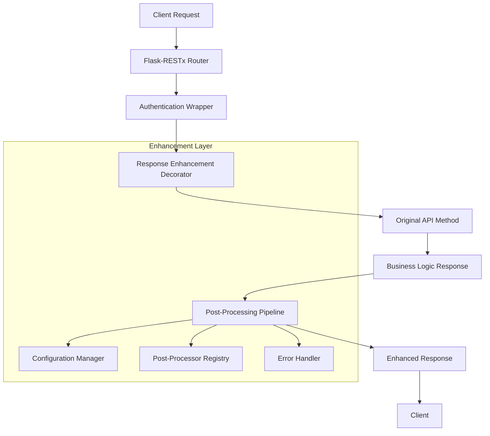

# Design Document: Service API Response Enhancement

## Overview

This design implements a minimal-invasive response enhancement framework for Dify's Service API controllers. The solution uses a decorator-based approach that wraps existing API endpoints to provide post-processing capabilities without modifying core business logic. The framework supports adding fields to JSON responses, conditional processing, and maintains full compatibility with Flask-RESTx.

## Architecture

The response enhancement system follows a layered architecture:



## Components and Interfaces

### 1. Response Enhancement Decorator

The core decorator that wraps API methods to provide post-processing capabilities:

```python
@response_enhancer(processors=['add_metadata', 'add_timing'])
def post(self, app_model: App, end_user: EndUser):
    # Original method implementation
    return original_response
```

**Interface:**
```python
def response_enhancer(
    processors: List[str] = None,
    enabled: bool = True,
    fail_silently: bool = True,
    config_key: str = None
) -> Callable
```

### 2. Post-Processor Registry

Manages available post-processors and their execution order:

```python
class PostProcessorRegistry:
    def register(self, name: str, processor: PostProcessor) -> None
    def get(self, name: str) -> PostProcessor
    def execute_pipeline(self, processors: List[str], response: Any, context: ProcessingContext) -> Any
```

### 3. Processing Context

Provides context information to post-processors:

```python
@dataclass
class ProcessingContext:
    request: Request
    app_model: App
    end_user: Optional[EndUser]
    endpoint_name: str
    method: str
    original_response: Any
    start_time: float
```

### 4. Post-Processor Interface

Base interface for all post-processors:

```python
class PostProcessor(ABC):
    @abstractmethod
    def process(self, response: Any, context: ProcessingContext) -> Any:
        """Process the response and return enhanced version"""
        pass
    
    @abstractmethod
    def can_process(self, response: Any, context: ProcessingContext) -> bool:
        """Check if this processor can handle the response"""
        pass
```

### 5. Configuration Manager

Handles configuration loading and management:

```python
class EnhancementConfig:
    def __init__(self, config_path: str = None)
    def get_processors_for_endpoint(self, endpoint: str) -> List[str]
    def is_enabled(self, endpoint: str = None) -> bool
    def reload(self) -> None
```

## Data Models

### Response Enhancement Configuration

```python
@dataclass
class EndpointConfig:
    endpoint_pattern: str
    processors: List[str]
    enabled: bool = True
    conditions: Dict[str, Any] = None

@dataclass
class GlobalConfig:
    enabled: bool = True
    default_processors: List[str] = None
    fail_silently: bool = True
    log_level: str = "INFO"
```

### Built-in Post-Processors

1. **MetadataProcessor**: Adds metadata fields like timestamps, request IDs
2. **TimingProcessor**: Adds processing time information
3. **VersionProcessor**: Adds API version information
4. **TenantProcessor**: Adds tenant-specific information
5. **CustomFieldProcessor**: Adds configurable custom fields

## Implementation Strategy

### Phase 1: Core Framework

1. **Decorator Implementation**
   - Create the main `@response_enhancer` decorator
   - Implement response type detection (JSON, streaming, etc.)
   - Add error handling and fallback mechanisms

2. **Registry System**
   - Implement PostProcessorRegistry
   - Create base PostProcessor class
   - Add processor discovery and registration

3. **Configuration System**
   - Create configuration file format (YAML/JSON)
   - Implement configuration loading and validation
   - Add hot-reload capability

### Phase 2: Built-in Processors

1. **Basic Processors**
   - MetadataProcessor for common fields
   - TimingProcessor for performance metrics
   - ErrorProcessor for error context

2. **Integration Processors**
   - TenantProcessor for multi-tenant information
   - UserProcessor for user context
   - AppProcessor for application metadata

### Phase 3: Advanced Features

1. **Conditional Processing**
   - Request-based conditions
   - Response-based conditions
   - User/tenant-based conditions

2. **Performance Optimization**
   - Response caching
   - Processor result caching
   - Async processing support

## Usage Examples

### Basic Usage

```python
# In completion.py
@service_api_ns.route("/completion-messages")
class CompletionApi(Resource):
    @service_api_ns.expect(completion_parser)
    @validate_app_token(fetch_user_arg=FetchUserArg(fetch_from=WhereisUserArg.JSON, required=True))
    @response_enhancer(processors=['metadata', 'timing'])  # Add this line
    def post(self, app_model: App, end_user: EndUser):
        # Original implementation unchanged
        response = AppGenerateService.generate(...)
        return helper.compact_generate_response(response)
```

### Configuration-Driven Usage

```yaml
# config/response_enhancement.yaml
global:
  enabled: true
  fail_silently: true
  default_processors: ['metadata']

endpoints:
  - pattern: "/completion-messages"
    processors: ['metadata', 'timing', 'tenant_info']
    conditions:
      response_type: "json"
  
  - pattern: "/chat-messages"
    processors: ['metadata', 'conversation_context']
    enabled: true
```

### Custom Processor Example

```python
class TenantInfoProcessor(PostProcessor):
    def can_process(self, response: Any, context: ProcessingContext) -> bool:
        return isinstance(response, dict) and context.app_model is not None
    
    def process(self, response: Any, context: ProcessingContext) -> Any:
        if self.can_process(response, context):
            response['tenant_info'] = {
                'tenant_id': context.app_model.tenant_id,
                'plan': self._get_tenant_plan(context.app_model.tenant_id)
            }
        return response
```

## Error Handling

The framework implements comprehensive error handling:

1. **Graceful Degradation**: If post-processing fails, return original response
2. **Detailed Logging**: Log all errors with context for debugging
3. **Circuit Breaker**: Disable problematic processors automatically
4. **Health Monitoring**: Provide metrics on processor success rates

```python
class ErrorHandler:
    def handle_processor_error(self, error: Exception, processor: str, context: ProcessingContext):
        logger.error(f"Processor {processor} failed: {error}", extra={
            'endpoint': context.endpoint_name,
            'user_id': context.end_user.id if context.end_user else None,
            'app_id': context.app_model.id if context.app_model else None
        })
        
        # Update failure metrics
        self.metrics.increment_failure(processor)
        
        # Check if processor should be disabled
        if self.metrics.get_failure_rate(processor) > 0.1:  # 10% failure rate
            self.registry.disable_processor(processor)
```

## Testing Strategy

### Unit Tests
- Test each post-processor independently
- Test decorator functionality with mock responses
- Test configuration loading and validation
- Test error handling scenarios

### Integration Tests  
- Test with actual Service API endpoints
- Test with different response types (JSON, streaming)
- Test configuration changes and hot-reload
- Test performance impact measurement

### Property-Based Tests
- Test response enhancement preserves original data
- Test processor pipeline ordering
- Test error recovery mechanisms

## Correctness Properties

*A property is a characteristic or behavior that should hold true across all valid executions of a system-essentially, a formal statement about what the system should do. Properties serve as the bridge between human-readable specifications and machine-verifiable correctness guarantees.*

### Property 1: Decorator Application Enables Post-Processing
*For any* API endpoint method, when decorated with the response enhancer, post-processing logic should execute after the original response is generated and before returning to the client.
**Validates: Requirements 1.1, 1.2**

### Property 2: Pipeline Execution Order
*For any* configured list of post-processors, they should execute in the specified order and each processor should receive the output of the previous processor.
**Validates: Requirements 1.3**

### Property 3: Error Recovery Preserves Original Response
*For any* post-processing error or failure, the system should log the error and return the original unmodified response to maintain service availability.
**Validates: Requirements 1.4, 6.1, 6.3**

### Property 4: Response Structure Preservation
*For any* response type (JSON, streaming, binary), the original response structure and HTTP status codes should be preserved when post-processing is applied or when errors occur.
**Validates: Requirements 1.5, 2.4**

### Property 5: JSON Field Addition
*For any* JSON response object, post-processors should be able to add new fields while preserving all existing fields and their values.
**Validates: Requirements 2.1, 2.2**

### Property 6: Conditional Processing
*For any* post-processor with defined conditions, field addition should only occur when the specified conditions (based on response content or request context) are met.
**Validates: Requirements 2.3**

### Property 7: Nested Structure Support
*For any* complex nested JSON response, post-processors should be able to add fields at any level of the structure without corrupting the existing hierarchy.
**Validates: Requirements 2.5**

### Property 8: Configuration-Driven Behavior
*For any* configuration change specifying different processors or rules, the system should apply the new configuration without requiring code modifications or service restarts.
**Validates: Requirements 3.1, 3.2**

### Property 9: Plugin Interface Extensibility
*For any* custom post-processor implementing the PostProcessor interface, it should be registerable and executable within the processing pipeline.
**Validates: Requirements 3.3**

### Property 10: Enable/Disable Control
*For any* endpoint or global configuration setting, post-processing should be enabled or disabled according to the configuration without affecting non-enhanced endpoints.
**Validates: Requirements 3.4**

### Property 11: Framework Compatibility
*For any* existing Flask-RESTx endpoint with authentication, validation, or error handling decorators, the response enhancer should work correctly when combined with these decorators.
**Validates: Requirements 4.3, 4.5**

### Property 12: Response Type Handling
*For any* response type (streaming or non-streaming), the enhancement system should handle it appropriately without breaking the response flow or client expectations.
**Validates: Requirements 4.4**

### Property 13: Service Layer Isolation
*For any* service layer or business logic code, it should remain completely unchanged when response enhancement is applied to the controller layer.
**Validates: Requirements 5.3**

### Property 14: Backward Compatibility
*For any* existing API client or contract, the enhanced responses should maintain backward compatibility by preserving all original fields and behaviors.
**Validates: Requirements 5.4**

### Property 15: Removability
*For any* system with response enhancement applied, removing the enhancement should restore the original functionality without any side effects or residual changes.
**Validates: Requirements 5.5**

### Property 16: Comprehensive Monitoring
*For any* post-processing operation, appropriate logs, metrics, and health status information should be generated and made available for monitoring and debugging.
**Validates: Requirements 3.5, 6.2, 6.4, 6.5**

## Testing Strategy

### Dual Testing Approach

The testing strategy employs both unit tests and property-based tests to ensure comprehensive coverage:

**Unit Tests** focus on:
- Specific processor implementations with known inputs/outputs
- Configuration loading and validation scenarios  
- Error handling edge cases
- Integration points with Flask-RESTx decorators
- Health check endpoint responses

**Property-Based Tests** focus on:
- Universal properties that hold across all inputs
- Response enhancement behavior with randomly generated responses
- Processor pipeline execution with various configurations
- Error recovery mechanisms with induced failures
- Compatibility testing with different response types

### Property-Based Testing Configuration

Each property test will be implemented using Python's `hypothesis` library with the following configuration:
- Minimum 100 iterations per property test
- Custom generators for API responses, configurations, and contexts
- Shrinking enabled to find minimal failing examples
- Each test tagged with format: **Feature: service-api-response-enhancement, Property {number}: {property_text}**

### Testing Framework Integration

The testing strategy integrates with Dify's existing testing infrastructure:
- Uses `pytest` framework following project conventions
- Implements Arrange-Act-Assert structure for unit tests
- Leverages existing test fixtures for Flask app and database setup
- Follows TDD approach: red → green → refactor
- Maintains strong typing and avoids `Any` types in test code